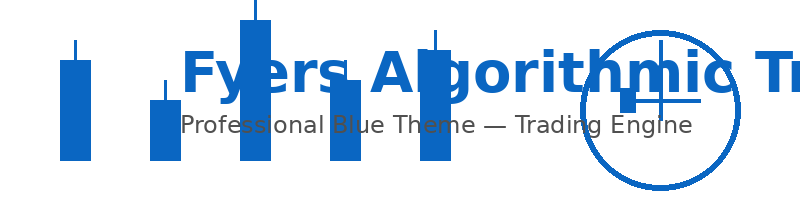

<p align="center">
  
</p>

<p align="center">
  <a href="https://github.com/Avi5205/Fyers-Algo-Bot"></a>
  <a href="https://www.python.org/"></a>
  <a href="https://fastapi.tiangolo.com/"></a>
  <a href="https://www.docker.com/"></a>
  <a href="LICENSE"></a>
</p>

# Fyers Algorithmic Trading Platform

> Production-grade algorithmic trading system for NSE equities using the Fyers API — real-time streaming, multi-strategy consensus, and Docker-ready deployment.

---

## Table of contents
- [Quick demo & assets](#quick-demo--assets)
- [Features](#features)
- [Architecture](#architecture)
- [Prerequisites](#prerequisites)
- [Installation](#installation)
- [Configuration](#configuration)
- [Usage](#usage)
- [Strategies](#strategies)
- [API Documentation](#api-documentation)
- [Deployment](#deployment)
- [Roadmap](#roadmap)
- [Contributing](#contributing)
- [License](#license)

---

## Quick demo & assets

<center>

</center>

---

## Features

- Real-time WebSocket price streaming (Fyers)
- 1-minute candle builder from ticks (OHLCV)
- Multi-strategy consensus (require ≥2 strategy votes)
- Paper and Live trading modes
- Configurable risk management (position sizing, daily loss limit)
- Docker Compose ready

---

## Architecture

```
Fyers WebSocket -> Real-time Engine (Candle Builder, Strategy Manager, Consensus)
                           -> TimescaleDB (OHLCV)
                           -> Order Execution (Fyers REST)
                           -> Frontend (React + Recharts)
```

---

## Prerequisites

- Python 3.11+
- Docker & Docker Compose
- Fyers account + API APP_ID and access token
- PostgreSQL + TimescaleDB
- Redis (optional but recommended)

---

## Installation

```bash
git clone https://github.com/Avi5205/Fyers-Algo-Bot.git
cd Fyers-Algo-Bot
cp .env.example .env
# edit .env to add FYERS_APP_ID and FYERS_ACCESS_TOKEN
```

### Using Docker (recommended)

```bash
docker-compose up -d
docker-compose logs -f backend
```

### Local Python (dev)

```bash
python3.11 -m venv .venv
source .venv/bin/activate
pip install -r requirements.txt
```

---

## Configuration

Edit `app/scripts/realtime_trading_engine.py` or `.env` for:

- Symbols list (NSE)
- Strategy parameters (EMA lengths, lookback, thresholds)
- Position sizing (POSITION_SIZE)
- Database connection strings

Sample `.env` variables:

```bash
FYERS_APP_ID=YOUR_APP_ID
FYERS_ACCESS_TOKEN=YOUR_ACCESS_TOKEN
DB_PASSWORD=your_db_password
POSITION_SIZE=5000
MIN_MOVE_PCT=0.5
```

---

## Usage

### Paper trading
```bash
./run_paper_trading.sh
```

### Live trading (use with caution)
```bash
./run_live_feed.sh
```

---

## Strategies

### EMA Crossover
- Fast EMA (9) / Slow EMA (21)
- Buy when fast crosses above slow; sell on cross below.

### Swing Trend
- Detect swing highs/lows with lookback (50).
- Enter on breakout with volatility filter.

### Scalping Mean Reversion
- 5-EMA deviation threshold (0.3%).
- Quick TP/SL.

**Consensus**: execute only when at least 2 strategies agree.

---

## API Documentation (FastAPI)

- `POST /api/bot/start?mode=paper` — start bot (paper/live)
- `POST /api/bot/stop` — stop bot
- `GET  /api/bot/status` — bot status and metrics
- `GET  /api/trades` — recent trades

Example status response:

```json
{
  "running": true,
  "mode": "paper",
  "positions": 2,
  "total_trades": 15,
  "total_pnl": 245.50
}
```

---

## Deployment

Recommended production setup:
- VPS with Docker (2 vCPUs, 4GB RAM)
- Managed Postgres/TimescaleDB
- Docker Compose + systemd restart policy
- GitHub Actions for CI (optional)

---

## Roadmap

- Phase 1: Real-time engine, consensus — ✅
- Phase 2: React dashboard, scanner, backtesting — 🚧
- Phase 3: ML signals, options, multi-broker — planned

---

## Contributing

1. Fork the repo
2. Create a branch for your changes
3. Add tests where appropriate
4. Open a PR describing the change

---

## License

This project is released under the MIT License. See [LICENSE](LICENSE).

---
