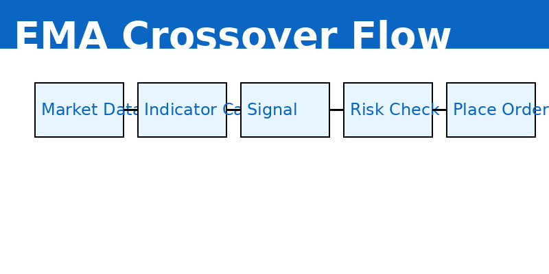
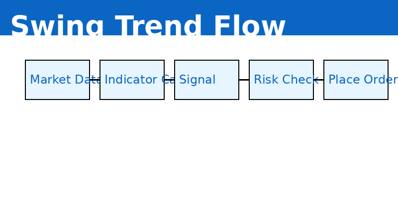
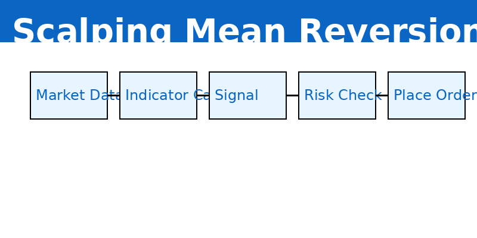

# Fyers Algorithmic Trading


> Production-grade algorithmic trading system for NSE equities using the Fyers API — real-time streaming, multi-strategy consensus, and Docker-ready deployment.

[](https://www.python.org/)
[](https://fastapi.tiangolo.com/)
[](https://www.docker.com/)
[](LICENSE)

---

## Table of Contents
- Features
- System Architecture
- Prerequisites
- Installation
- Configuration
- Usage
- Strategies
- API Docs
- Deployment
- Roadmap
- Disclaimer
- License

---


## Features

- Real-time WebSocket streaming from FYERS
- Candle builder (1-min OHLCV) from ticks
- Multi-strategy consensus (>=2 strategies to trade)
- Paper and Live modes
- Risk management and position sizing
- Dockerized deployment

---

## System Architecture


---

## Quick Start

```bash
git clone https://github.com/yourusername/fyers-algo.git
cd fyers-algo
cp .env.example .env
# Edit .env with FYERS_APP_ID and FYERS_ACCESS_TOKEN
docker-compose up -d
```

---

## Images & Diagrams

Strategy flows:





---

## Contributing

Please open issues or pull requests on GitHub. Follow the repository code style and testing guidelines.

---

## License

MIT License.

